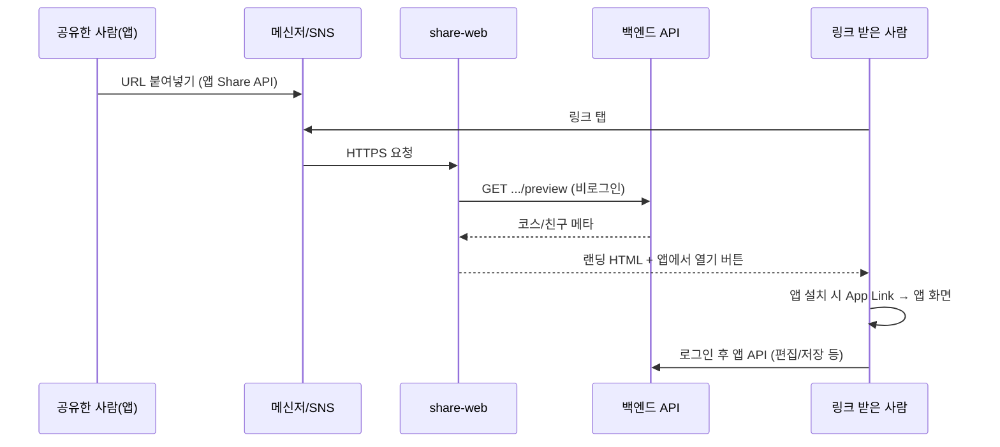

# 공유 루트 · 링크 공유 — 백엔드 / 웹(share-web) 작업 분리

> **대상:** 백엔드 팀, share-web(웹 랜딩) 팀, 모바일 앱 담당  
> **앱 레포:** `capstone/front` (React Native / Expo)  
> **작성일:** 2026-05-25

---

## 1. 한 줄 요약

| 구분 | 역할 |
|------|------|
| **모바일 앱** | 공유 URL **생성** + 링크 클릭 시 **앱으로 열기**(딥링크) — 코드는 이미 있음, **스토어 빌드·도메인 검증** 필요 |
| **share-web (웹)** | 링크를 **브라우저에서 열었을 때** 미리보기·「앱에서 열기」·스토어 이동 + **App Link 검증 파일** 호스팅 |
| **백엔드** | 웹·앱이 쓰는 **preview·공개 조회 API** 비로그인 허용, **CORS**, 공동 루트 **초대·권한 API** |

**앱만 배포해도** 카카오톡 등에 URL 문자열 붙여넣기는 됩니다.  
**링크를 눌렀을 때** 웹 미리보기·앱 자동 실행이 되려면 **웹 + 백엔드 + (Android/iOS) 도메인 연동**이 같이 필요합니다.

---

## 2. 공유 URL 형식 (앱·웹·백엔드 공통)

베이스 도메인: `EXPO_PUBLIC_SHARE_BASE_URL` → 예: `https://eodigaljido.uk`

| 용도 | URL 패턴 | 앱 딥링크 매핑 (`constants/shareLinking.ts`) |
|------|----------|---------------------------------------------|
| **공개 코스** (공유 루트 탭) | `https://{host}/courses/public/{courseId}` | `Tabs` → `SharedRoute` (`viewCourseId`) |
| **친구 초대** | `https://{host}/friends/add/{friendCode}` | `Tabs` → `All` (`friendCode`) |
| **공동 루트 편집 초대** | `https://{host}/routes/collaborative/{courseId}` | `RouteCreate` (`editRouteId`, `collaborative: true`) |

앱 스킴(폴백): `eodigaljido://` — 동일 path 사용 가능.

---

## 3. 사용자 흐름 (누가 무엇을 하는지)



---

## 4. 백엔드 — 지금 바로 해야 할 일

### 4.1 P0 — 링크가 열리기만 해도 필요 (웹 + 앱 공통)

#### (1) Preview API 비로그인 허용 (`permitAll`)

share-web·카카오/브라우저 프리뷰는 **JWT 없음**. 아래가 **401**이면 웹 랜딩이 깨집니다 (`DEPLOY.md` §7 참고).

| Method | Path | 용도 |
|--------|------|------|
| GET | `/api/courses/public/{courseId}/preview` | 공개 코스 링크 미리보기 (제목, 썸네일, 출발·도착 등 **최소 필드**) |
| GET | `/api/friends/code/{friendCode}/preview` | 친구 코드 링크 미리보기 (닉네임 등) |

**권장 응답 예 (공개 코스 preview):**

```json
{
  "id": "uuid",
  "title": "코스 제목",
  "departure": "출발",
  "arrival": "도착",
  "thumbnail": "https://...",
  "authorNickname": "작성자"
}
```

**주의:** `GET /api/courses/public/{id}` 본 API를 preview 대신 쓰려면 역시 **비로그인 허용**이어야 합니다. 보안상 **preview 전용 DTO**(민감 정보 제외)를 두는 편이 안전합니다.

#### (2) CORS — share-web 도메인 허용

| 설정 | 값 예시 |
|------|---------|
| `Access-Control-Allow-Origin` | `https://eodigaljido.uk` (운영), 로컬 개발 시 `http://localhost:5173` 등 |
| Methods | `GET`, `OPTIONS` (preview는 GET만이면 GET) |
| Headers | `Content-Type` |

Spring Security 예: preview 경로만 `permitAll` + CorsConfiguration에 share 도메인 등록.

#### (3) 공동 루트 링크 — 편집 권한 API (P0, 앱 기능 완성용)

앱 경로: `/routes/collaborative/{courseId}`  
수신자가 앱에서 열었을 때 **편집 가능 여부** 검증 필요 (현재 앱은 코스 상세만 로드, 멤버 API 미연동).

| Method | Path | 설명 |
|--------|------|------|
| GET | `/api/courses/collaborative/{courseId}` | 로그인 사용자 기준 **초대·편집 권한** + 루트 메타 (또는 403) |
| POST | `/api/courses/my/{courseId}/invites` | (선택) 초대 링크·토큰 발급, 만료 |
| GET | `/api/courses/my/{courseId}/members` | (선택) 멤버 목록 — 앱 멤버 UI 연동 |

**최소 동작:** 링크로 들어온 사용자가 해당 `courseId`에 대해 `PATCH /api/courses/my/{courseId}` 등을 할 수 있는지 백엔드에서 판단.

---

### 4.2 P1 — 공유·초대 품질

| 항목 | 설명 |
|------|------|
| `FriendResponse.userId` | `POST /chats/{roomUuid}/members`가 `userId` 필요 → `GET /api/friends`에 `userId` 포함 |
| `courseUuid` ↔ `chatRoomUuid` | 공동 루트 저장 시 채팅방 연결 (`GET /api/courses/my/{id}/chat-room` 또는 상세에 필드) |
| `collaborative` 플래그 문서화 | 공개 목록·초대·편집 권한 관계 Swagger description 정리 |
| Open Graph용 필드 | preview에 `description`, `imageUrl` 등 웹 `<meta>`에 쓸 필드 |

---

### 4.3 P2 — 인프라·운영 (백엔드/데브옵스 협의)

| 항목 | 설명 |
|------|------|
| API 베이스 URL | 앱: `EXPO_PUBLIC_API_BASE_URL` (예: `http://3.36.85.213:8080/`) — 운영 HTTPS 고정 권장 |
| Rate limit | preview `permitAll`에 IP/경로 단위 제한 (스크래핑 방지) |
| 로깅 | preview 404 vs 401 구분 (웹 디버깅용) |

---

### 4.4 백엔드 체크리스트

- [ ] `GET /api/courses/public/{courseId}/preview` — **401 없이** 비로그인 조회
- [ ] `GET /api/friends/code/{friendCode}/preview` — 동일
- [ ] CORS에 `https://eodigaljido.uk` (및 스테이징) 등록
- [ ] `GET /api/courses/collaborative/{courseId}` (또는 동등) — 링크 수신자 편집 권한
- [ ] (선택) members / invites API
- [ ] Swagger·팀 문서에 preview·collaborative 경로 명시

---

## 5. share-web (웹 프론트) — 따로 해야 할 일

> 레포 예: `eodigaljido-share-web` (Vite 등 **별도 프로젝트**).  
> 이 모바일 레포(`front`)에는 웹 랜딩 소스가 **없음**.

### 5.1 배포·인프라 (P0)

| 항목 | 설명 |
|------|------|
| **DNS** | `eodigaljido.uk` → 웹 서버 (CloudFront, Nginx, Vercel 등) |
| **HTTPS** | App Link / Universal Links는 **HTTPS 필수** |
| **SPA fallback** | `/courses/public/*`, `/friends/add/*`, `/routes/collaborative/*` 모두 `index.html`로 라우팅 (404 방지) |

### 5.2 라우트별 화면 (P0)

| Path | 화면 동작 |
|------|-----------|
| `/courses/public/:courseId` | preview API 호출 → 제목·경로·썸네일 표시 → **「앱에서 열기」** / 스토어 링크 |
| `/friends/add/:friendCode` | friend preview API → **「앱에서 친구 추가」** |
| `/routes/collaborative/:courseId` | (preview API 없으면) 안내 문구 + **「앱에서 공동 편집 참여」** — 백엔드 preview 추가 시 동일 패턴 |

**401/404 시:**  
- axios에 **앱 JWT·쿠키 넣지 말 것**  
- 사용자에게 「앱을 설치하고 링크를 다시 열어 주세요」 + 스토어 버튼만 표시

### 5.3 App Link / Universal Link 검증 파일 (P0)

Android·iOS가 도메인을 앱에 연결하려면 **웹 호스트**에서 아래 파일을 제공해야 합니다.  
(앱 `app.config.js`에 이미 pathPrefix 등록됨)

| 파일 | 호스트 경로 | 내용 |
|------|-------------|------|
| **Android** Digital Asset Links | `https://{host}/.well-known/assetlinks.json` | 패키지명, SHA256 인증서 지문 (`expo credentials` / Play Console) |
| **iOS** AASA | `https://{host}/.well-known/apple-app-site-association` | `applinks:{host}`, paths: `/courses/public/*`, `/friends/add/*`, `/routes/collaborative/*` |

배포 시 `Content-Type: application/json`, 리다이렉트 없이 **200**으로 직접 응답.

### 5.4 웹 앱 구현 (P0)

| 항목 | 설명 |
|------|------|
| API 베이스 | `VITE_API_BASE_URL` = 백엔드와 동일 (앱의 `EXPO_PUBLIC_API_BASE_URL`) |
| 인증 | preview 호출만 — **Authorization 헤더 없음** |
| 「앱에서 열기」 | Custom URL: `eodigaljido://courses/public/{id}` 또는 동일 HTTPS URL (OS가 앱으로 위임) |
| 스토어 링크 | Play / App Store URL (운영 앱 id 확정 후) |
| OG 태그 | 카톡·iMessage 미리보기: `og:title`, `og:description`, `og:image` (preview 응답 기반) |

### 5.5 P1 — UX·운영

| 항목 | 설명 |
|------|------|
| 로딩 / 에러 UI | preview 실패 시에도 랜딩은 표시 |
| 스테이징 | `share-staging.*` + 백엔드 CORS·preview 동일 적용 |
| 공동 루트 preview | 웹 `/routes/collaborative/:id` 연동 완료 — 백엔드 `GET .../collaborative/{id}/preview` 추가 시 메타 품질 향상 |
| analytics | 링크 유입 path·courseId (선택) |

### 5.6 share-web 체크리스트

- [ ] HTTPS + DNS `eodigaljido.uk` *(인프라)*
- [x] SPA 3종 path 라우팅 + fallback (`router.tsx`, 배포 시 Nginx `try_files`)
- [x] preview API 연동 (토큰 없음, 401/404 시 폴백 랜딩)
- [x] `assetlinks.json` / `apple-app-site-association` (`public/.well-known/` — SHA-256·TEAM_ID는 배포 전 교체)
- [x] 앱에서 열기 · 스토어 버튼
- [x] OG 메타 (코스·친구·공동 루트)

---

## 6. 모바일 앱 — 이미 된 일 / 추가로 할 일

**이 레포에서 이미 구현됨 (백엔드·웹 없이도 URL 생성 가능):**

| 기능 | 파일 |
|------|------|
| 공개 코스 링크 생성·공유 | `utils/shareCourse.ts` |
| 공동 루트 링크 생성·공유 | `utils/shareCollaborativeRoute.ts` |
| URL 파싱 | `utils/parseSharePath.ts` |
| 딥링크 설정 | `constants/shareLinking.ts`, `app.config.js` (intentFilters, associatedDomains) |
| 비로그인 시 링크 보관 → 로그인 후 이동 | `utils/pendingShareLink.ts` |

**앱 팀이 추가로 할 일 (웹·백엔드와 별개):**

| 항목 | 설명 |
|------|------|
| **EAS production 빌드** | `EXPO_PUBLIC_SHARE_BASE_URL` 운영 도메인과 일치 |
| **새 네이티브 빌드** | `app.config.js` intentFilters 변경 후 OTA만으로는 App Link 불가 |
| **도메인 검증** | Android App Links verified, iOS Associated Domains |
| **Expo Go 한계** | 링크·App Link는 **개발 빌드/스토어 빌드**에서만 검증 |

---

## 7. 담당 매트릭스 (빠른 참조)

| 증상 | 원인 후보 | 담당 |
|------|-----------|------|
| 링크 공유 시 URL만 나오고 끝 | 정상 (앱 역할 끝) | — |
| 링크 탭 시 404 HTML | share-web 미배포 / SPA fallback 없음 | **웹** |
| 링크 탭 시 빈 화면·CORS 에러 | preview 401 또는 CORS | **백엔드** |
| 웹은 되는데 앱이 안 열림 | assetlinks / AASA / 빌드 미반영 | **웹** + **앱 빌드** |
| 앱은 열리는데 편집 불가 | collaborative 권한 API 없음 | **백엔드** |
| 친구 초대 링크만 실패 | friend preview 401 | **백엔드** |

---

## 8. 권장 작업 순서

1. **백엔드:** preview `permitAll` + CORS (웹 랜딩 즉시 가능)  
2. **share-web:** DNS/HTTPS + 3 path 랜딩 + preview 연동  
3. **share-web:** `.well-known` 2종 배포  
4. **앱:** production 빌드 + App Link 실기기 테스트  
5. **백엔드:** collaborative 진입·members API (공동 루트 링크 완전 동작)  

---

## 9. 관련 문서

- [backend-requests-by-feature.md](./backend-requests-by-feature.md) — §4 공유·딥링크
- [backend-integration-spec.md](./backend-integration-spec.md) — 전체 API 연동
- [DEPLOY.md](../DEPLOY.md) — §7 share-web 401, §8 공유 링크
